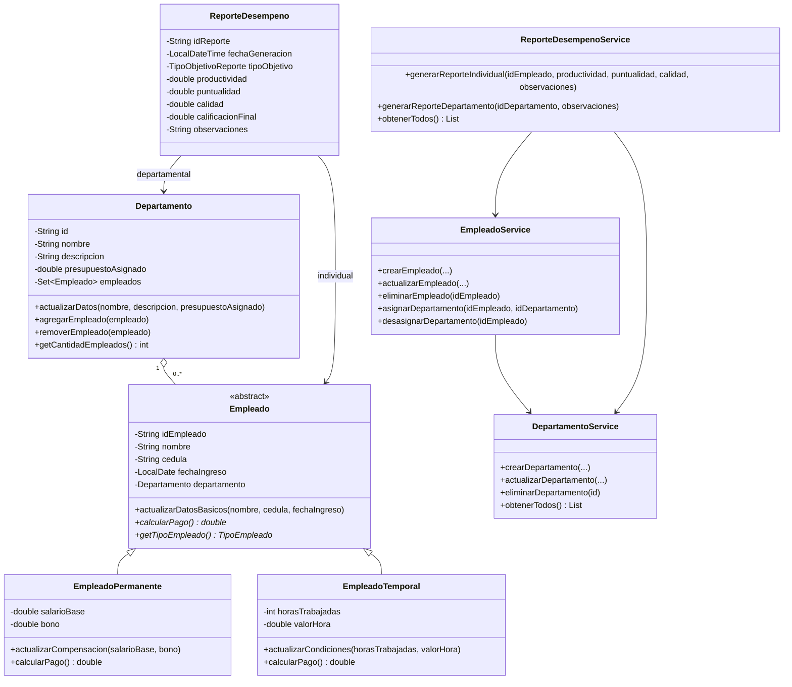

# Diagrama UML de clases

```mermaid
classDiagram
    class Empleado {
        <<abstract>>
        -String idEmpleado
        -String nombre
        -String cedula
        -LocalDate fechaIngreso
        -Departamento departamento
        +actualizarDatosBasicos(nombre, cedula, fechaIngreso)
        +calcularPago()* double
        +getTipoEmpleado()* TipoEmpleado
    }

    class EmpleadoPermanente {
        -double salarioBase
        -double bono
        +actualizarCompensacion(salarioBase, bono)
        +calcularPago() double
    }

    class EmpleadoTemporal {
        -int horasTrabajadas
        -double valorHora
        +actualizarCondiciones(horasTrabajadas, valorHora)
        +calcularPago() double
    }

    class Departamento {
        -String id
        -String nombre
        -String descripcion
        -double presupuestoAsignado
        -Set~Empleado~ empleados
        +actualizarDatos(nombre, descripcion, presupuestoAsignado)
        +agregarEmpleado(empleado)
        +removerEmpleado(empleado)
        +getCantidadEmpleados() int
    }

    class ReporteDesempeno {
        -String idReporte
        -LocalDateTime fechaGeneracion
        -TipoObjetivoReporte tipoObjetivo
        -double productividad
        -double puntualidad
        -double calidad
        -double calificacionFinal
        -String observaciones
    }

    class EmpleadoService {
        +crearEmpleado(...)
        +actualizarEmpleado(...)
        +eliminarEmpleado(idEmpleado)
        +asignarDepartamento(idEmpleado, idDepartamento)
        +desasignarDepartamento(idEmpleado)
    }

    class DepartamentoService {
        +crearDepartamento(...)
        +actualizarDepartamento(...)
        +eliminarDepartamento(id)
        +obtenerTodos() List
    }

    class ReporteDesempenoService {
        +generarReporteIndividual(idEmpleado, productividad, puntualidad, calidad, observaciones)
        +generarReporteDepartamento(idDepartamento, observaciones)
        +obtenerTodos() List
    }

    Empleado <|-- EmpleadoPermanente
    Empleado <|-- EmpleadoTemporal
    Departamento "1" o-- "0..*" Empleado
    ReporteDesempeno --> Empleado : individual
    ReporteDesempeno --> Departamento : departamental
    EmpleadoService --> DepartamentoService
    ReporteDesempenoService --> EmpleadoService
    ReporteDesempenoService --> DepartamentoService
```
